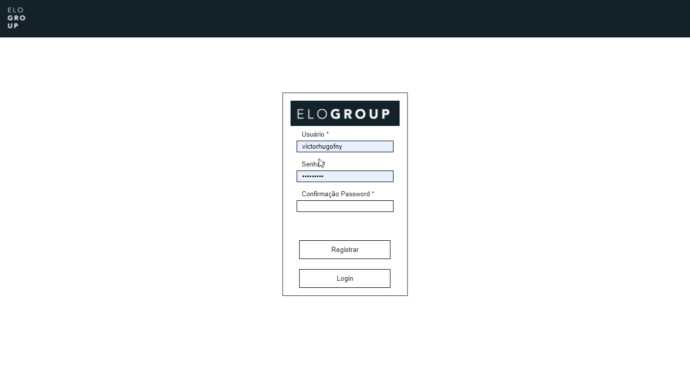
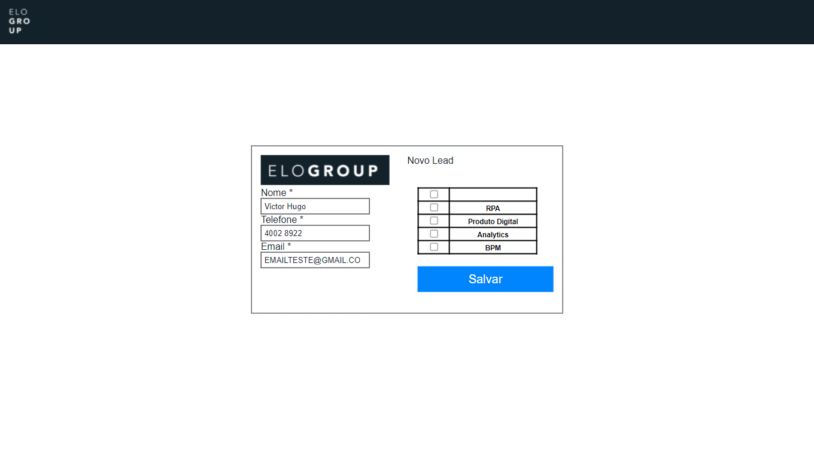

<h1>Case Fullstack, estagio Elogroup</h1>
<h4 align="left">🚀 Desafio de estagio na empresa Elogroup.</h4>
<h4 align="left">A aplicação desenvolvida, foi implementada usando Vue.js, será armazenado dados do usuário, para registro e login usando Localstorage, a aplicação tem como objetivo fazer a manutenção de Leads.</h4>

## Preview
<p align="center">
  
</p>

## Painel de Leads
<p align="center">
  
</p>

### Download Project (Baixar projeto)
[Clique aqui para baixar o repositorio](https://github.com/VictorHugofny/EloGroup_Case_Estagio_FullStack/archive/refs/heads/main.zip).

### Project setup (Configuração do projeto)
```
npm install
```

### Compiles and hot-reloads for development (Execultando)
```
npm run serve
```

### Compiles and minifies for production (Modo de produção)
```
npm run build
```

### Lints and fixes files
```
npm run lint
```

